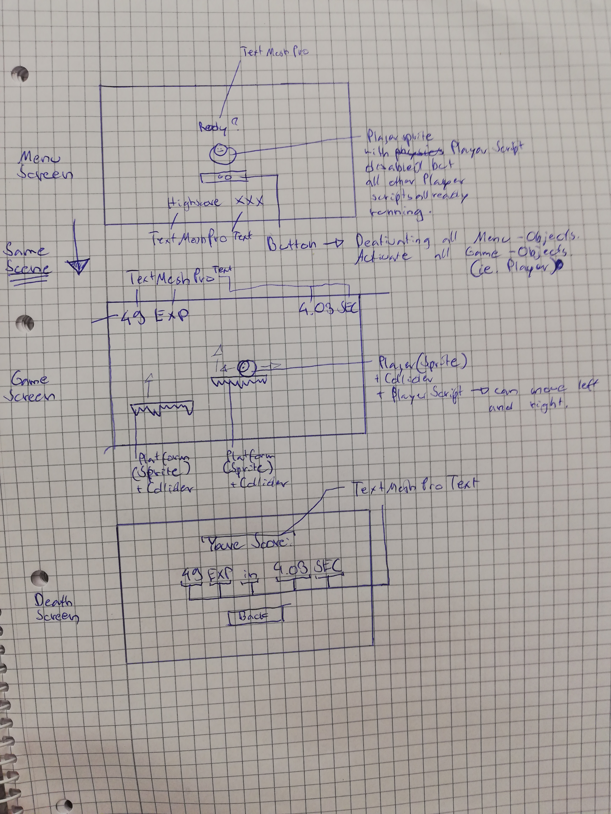
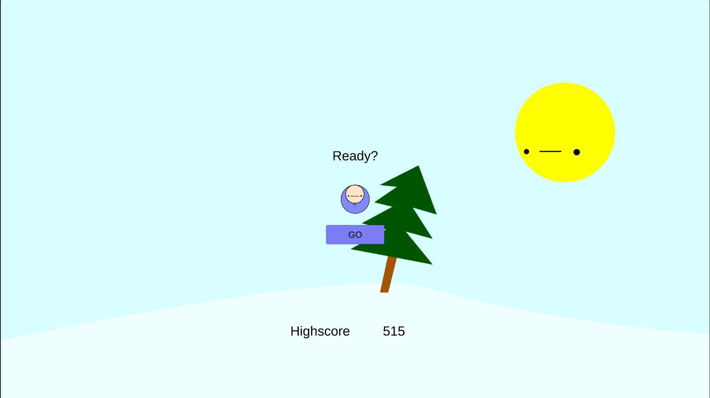
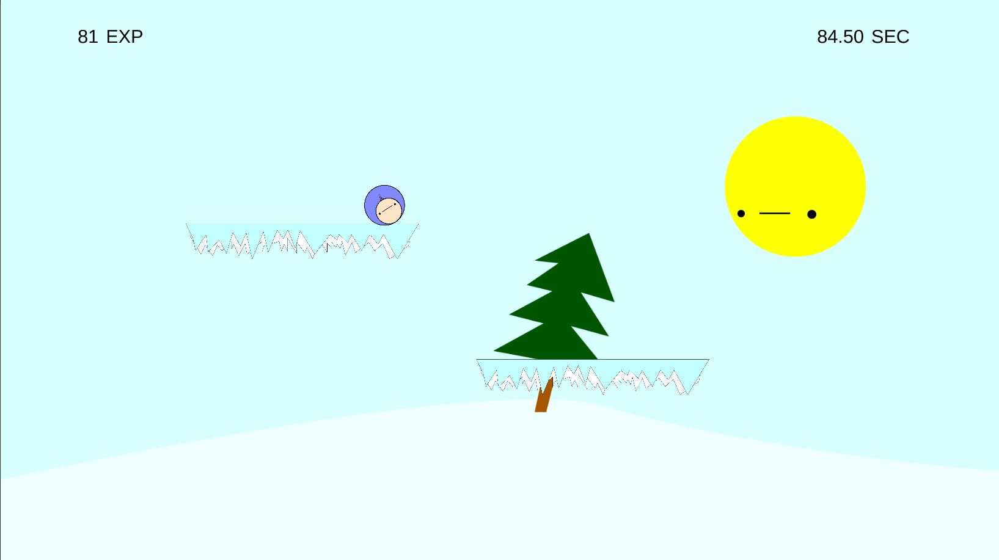

# LiftUp
Try to fall as much as you can but not to far. Dont touch anything like spikes or screen borders!

# Dev-Platform: 
 Windows 10 64-bit, Unity 2018.2.14f1, Visual Studio Community 15.9.3  
 Scripting Runtime Verion .NET 3.5 Equivalent  
 Api Compatibility Level .NET 2.0 Subset
 
# Target-Platfrom: 
 Standalone PC  
 Resolution 1920x1080

# Status: 
 Implementation finished 100%

# Controls: 
 On X-Axis, with AD or Left and Right.

# Concept:
(2D Game)
The Player can move left and right with the AD and horizontal arrow keys. 
If the Player touches any of the four screens borders, he dies and its game over. 
Ice platforms spawn randomly underneath the screen and move up in random speeds. 
If the Player touches the spikes of any platform, which are located on the lower side, he dies. 
If a platform crashed into another one from below the lower one crashing breaks. 
When the Player is in the air you gain experience (score). 
A Timer shows you how long you have survived. When you eventually die, 
you’ll be greeted with the Game Over Screen and be shown your current score, 
going back to the main menu will not only give you the ability to play again but also show you your high score. 
– This means the Player needs to fall from platform to platform without getting smashed by them nor touch the screen borders i.e. go to high or fall down or go to far out to the sides.

The Player dies when:
 - touching the spikes of any platform
 - falling out of the cameras view
 - hitting the top of the cameras view

# Screens sketch

# Gameplay Screenshots

**Menu:**  

**InGame:**  

**GameOver:**  

# Lessons Learned and Limitatons
When using the Update method to move objects it binds the speed of your object to your framerate which is not optimal. 
Use a fixed frame interval instead.  
So if you happen to play the game on a more powerful machine, don't be suprised by the incredible speeds.

# Resources used
none

**Copyright by Leonhard Schnaitl**
