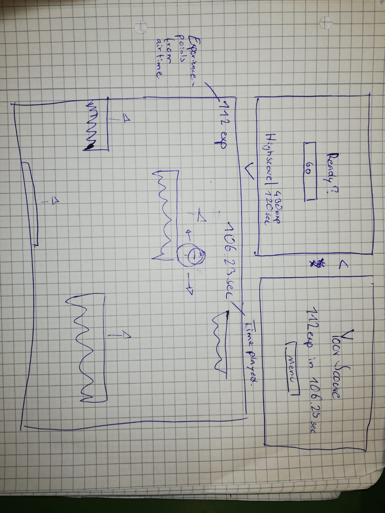

# LiftUp
Simple Unity game.

# Dev-Platform: 
 Win 10, Unity 2018.2.14f1, Visual Studio Community 15.9.3
 
# Target-Platfrom: 
 Standalone PC

# Status: 
 implementation

# Controls: 
 On X-Axis, with AD or Left and Right.

# Concept:
The Player can move left and right with the AD and horizontal arrow keys. 
If the Player touches any of the four screens borders, he dies and its game over. 
Ice platforms spawn randomly underneath the screen and move up in random speeds. 
If the Player touches the spikes of any platform, which are located on the lower side, he dies. 
If a platform crashed into another one from below the lower one crashing breaks. 
When the Player is in the air you gain experience (score). 
A Timer shows you how long you have survived. When you eventually die, 
you’ll be greeted with the Game Over Screen and be shown your current score, 
going back to the main menu will not only give you the ability to play again but also show you your high score. 
– This means the Player needs to fall from platform to platform without getting smashed by them nor touch the screen borders i.e. go to high or fall down or go to far out to the sides.

The Player dies when:
 - touching the spikes of any platform
 - falling out of the cameras view
 - hitting the top of the cameras view

# Screens sketch

# Resources used
+ [Singleton.cs/UnityWiki](http://wiki.unity3d.com/index.php/Singleton)

**Copyright by Leonhard Schnaitl**
